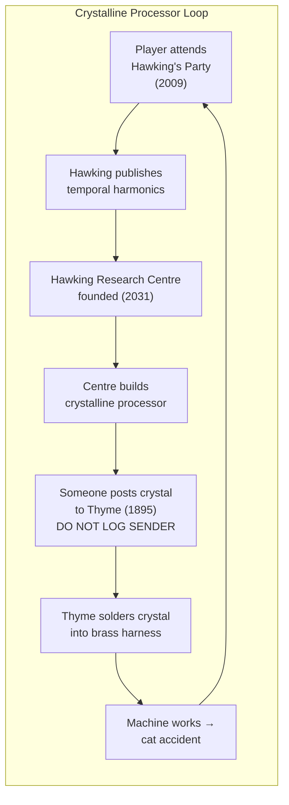
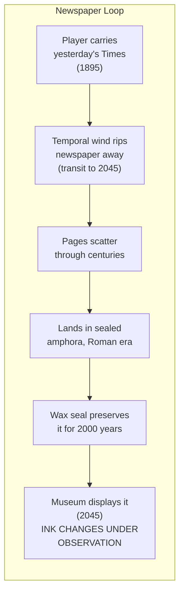
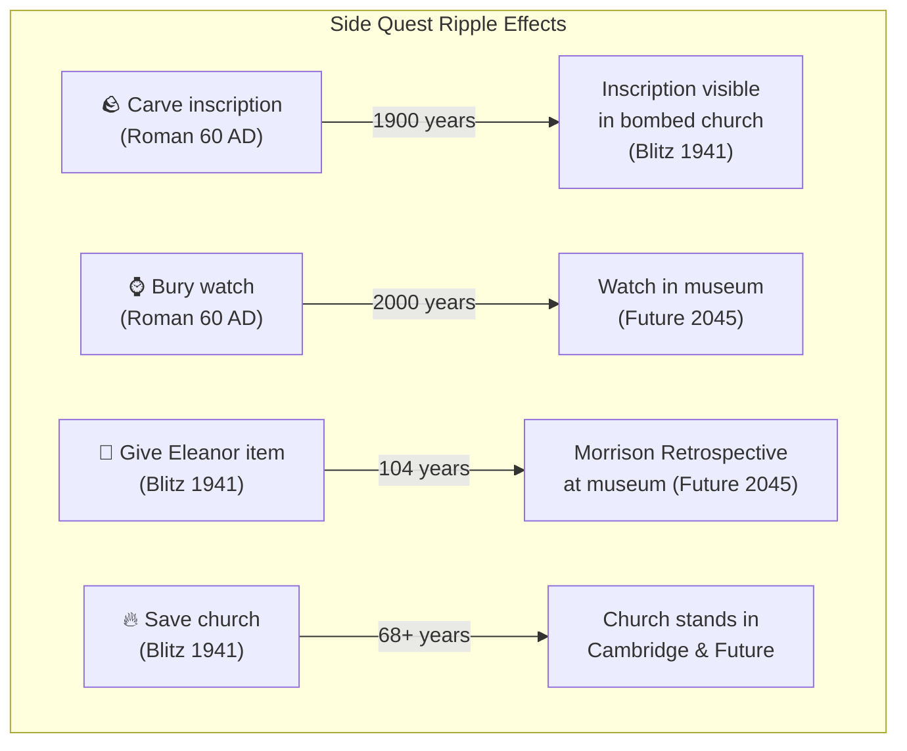
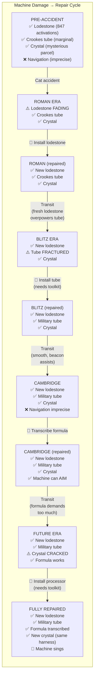

# The Temporal Apprentice — Story Flow

```mermaid
flowchart TD
    subgraph WORKSHOP["WORKSHOP (1895)"]
        W1[Knock on door] --> W2[Meet Dr. Thyme]
        W2 --> W3[Give spanner]
        W3 --> W4[Thyme departs for scones]
        W4 --> W5[Explore solarium]
        W5 --> W6[Cat steals rag, climbs machine]
        W6 --> W7["Grab cat → cat kicks lever"]
    end

    W7 ==>|"⚡ LODESTONE FADES<br/>847 activations + 1 uncontrolled transit"| R1

    subgraph ROMAN["ROMAN LONDINIUM (60 AD)"]
        R1[Arrive in Forum] --> R2[Trade aureus for lodestone]
        R2 --> R3[Show lodestone to Marcus]
        R3 --> R4{Side quests}
        R4 -->|"🪨 Carve inscription"| R4a["Temple wall inscription<br/>(inscription_carved)"]
        R4 -->|"⌚ Bury watch"| R4b["Thames dock time capsule<br/>(capsule_buried)"]
        R3 --> R5["GATE: Soldiers surround machine<br/>Show lodestone to Marcus"]
        R5 --> R6["🔧 REPAIR: Install lodestone<br/>Compass housing glows steady"]
    end

    R6 ==>|"⚡ CROOKES TUBE FRACTURES<br/>Fresh lodestone pushes too much power<br/>through marginal glass"| B1

    subgraph BLITZ["BLITZ LONDON (1941)"]
        B1[Arrive in blackout] --> B2[Fix Tommy's radio]
        B2 --> B3[Tommy helps dig out machine]
        B3 --> B4[Find vacuum tube in supply crate]
        B4 --> B5{Side quests}
        B5 -->|"🔥 Extinguish fire"| B5a["Save St. Margaret's Church<br/>(church_saved)"]
        B5 -->|"🎁 Give item to Eleanor"| B5b["Eleanor becomes artist<br/>(eleanor_gift)"]
        B3 --> B6["GATE: Machine buried under rubble<br/>Dig with Tommy's help"]
        B6 --> B7["🔧 REPAIR: Install vacuum tube<br/>Bend contacts with pliers, hum shifts"]
    end

    B7 ==>|"Lodestone + tube restored<br/>Smoothest transit yet<br/>Hawking's beacon assists"| C1

    subgraph CAMBRIDGE["CAMBRIDGE (2009)"]
        C1["Arrive at College Gates<br/>Hawking's Time Traveller's Party"] --> C2[Find invitation in garden]
        C2 --> C3[Give invitation to porter]
        C3 --> C4[Meet Hawking in Great Hall]
        C4 --> C5["Tell about time + show journal + show lodestone"]
        C5 --> C6["Hawking convinced → prints formula"]
        C6 --> C7[Take dot-matrix printout]
        C7 --> C8["🔧 REPAIR: Transcribe formula<br/>Machine can AIM for the first time"]
    end

    C8 ==>|"⚡ CRYSTAL CRACKS<br/>Formula demands more than crystal can handle<br/>📰 Newspaper torn away by temporal wind"| F1

    subgraph FUTURE["FUTURE LONDON (2045)"]
        F1["Arrive in flooded street<br/>Crystal cracked"] --> F2[Help Kai → get diving gear]
        F2 --> F3["GATE: Machine underwater<br/>Haul up with diving gear"]
        F2 --> F4[Enter submerged lab]
        F4 --> F5["Hawking Temporal Research Centre<br/>(Founded 2031)"]
        F5 --> F6["Find dispatch log:<br/>UNIT 0001-ALPHA → J. THYME<br/>DO NOT LOG SENDER"]
        F5 --> F7[Open cabinet with formula code]
        F7 --> F8[Take crystalline processor]
        F8 --> F9["🔧 REPAIR: Install processor<br/>Same harness, same perfect fit<br/>Machine fully repaired"]
    end

    F3 & F9 ==>|"Silk through water —<br/>first smooth transit"| E1

    subgraph ENDGAME["ENDGAME — WORKSHOP (1895)"]
        E1["Return to workshop<br/>(all 4 components installed)"] --> E2[Clean workshop]
        E2 --> E3["Dr. Thyme returns from tea ☕"]
    end
```

## Bootstrap Paradoxes

## Cross-Era Causality

## Progressive Damage

## Newspaper Headlines (BTTF Effect)

| Causality Flag | Default Headline | Changed Headline | Ink Effect |
|---|---|---|---|
| `inscription_carved` | Restoration Works — Nothing of Interest | Mysterious Inscription — Latin Predates Foundation | Freshly printed, paper yellowed |
| `capsule_buried` | Thames Excavation — Pottery, Adequate | Victorian Pocket Watch in Roman Stratum | Letters shimmer and rearrange |
| `eleanor_gift` | Gallery Exhibition — Nothing Remarkable | Eleanor Morrison Retrospective | Photograph fades in/out |
| `church_saved` | Car Park on Church Site Approved | St. Margaret's 600th Anniversary | Ink almost smudges under thumb |
